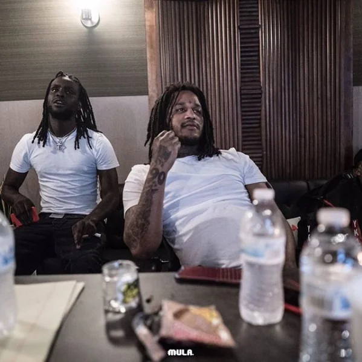

# chicago drill scene

### beats for videos
* [dis aint what u want](https://www.youtube.com/watch?v=TybFtK6VTVo)

### Resources
1. **Tookaville** is a nickname for the Tooka Gang, a Gangster Disciples set in Chicago, Illinois. The gang is also known as Saint Lawrence Boys/Eberhart (STL/EBT). The gang adopted the name in honor of Shondale "Tooka" Gregory, a 15-year-old who was murdered. 
Tookaville is located at 63rd Street and St. Lawrence. 
 The street is home to famous rappers, including FBG Duck and Lil Jay. 
The term "63rd" was popularized by the famous rapper King Von. In his songs, he described 63rd as a nasty and crooked place because it was his rival block in Chicago
2. **DJ Kenn**, also known as DJ Kenn AON or DJ Kenn AllOrNothing, is a record producer and member of Glo Gang. He was born in Japan and moved to Chicago at age 20 to pursue music. He has produced for artists including Chief Keef, Yung Lean, G Herbo, Fredo Santana, and Thaiboy Digital. 
DJ Kenn was introduced to hip hop through Nas's 2001 album Stillmatic. He became obsessed with the genre, but there was no hip-hop scene in Yamagata at the time. He moved to Chicago without knowing any English. 
DJ Kenn's genres include Chicago Drill, Drill, and Cloud Rap. 

3. **Front Street** is a set of the Black Disciples (BDs) gang in Chicago. 
 The BDs are a Chicago "folks" gang that is structured more like a religion than a corporate enterprise. 
 The BDs are known to engage in violence with other Folks gangs, including the Gangster Disciples. The BDs' colors are blue, red, and black. 
The BDs gained international publicity in 1994 when they executed an 11-year-old member. The BDs trace their historical roots directly to "King David Barksdale". 
The BDs are located on 61st and Indiana in Chicago.

Chief Keef and Fredo Santana, two rappers from Frontstreet that became famous. RIP Fredo.

4. **“Glory Boyz”** is a song by Chief Keef featuring Fredo Santana and SD. You can listen to the song on SoundCloud and Shazam, or watch the official music video on YouTube. 
The song was produced by DJ Kenn and appears on the Hip-Hop DNA: Origins Apple Music playlist. You can also check out the song on the Bang Mixtape. 
Chief Keef founded Glory Boyz Entertainment (Glo Gang) in 2011. The group is active in hip-hop, trap, and drill.
5. **Odee Perry** was an actor and Black Disciple from Chicago, Illinois. He was born on May 13, 1991 and died on August 11, 2011. Perry was known for his role in In This Bitch Remix (2011) by Chief Keef and Lil Reese. 
On August 10, 2011, Perry was riding his bike across the street from WIIC City when he was shot in the neck, shoulder, back, and buttocks. He was 20 years old. 
Perry's death led to the 6400 block of South King Drive being renamed "O Block". The block was previously known as "WIIIC CITY". 
Perry was suspected of killing Tooka
6. The "STL/EBT" set also know as TookaVille or Tooka Gang, are made up of two Gangster Disciple sets who merged. They are a primarily African-American street gang that reside on the South Side of Chicago, most known to be around 63rd & St. Lawrence and 63rd & Eberhart. The two sets formed an alliance when a high-ranking member from STL also known as "C-BALL" began to get close with EBT members, the two sets decided to form together. The set has many different cliques and subsets as well like "TOOKA GANG" which was made to honor a deceased member of STL. They also have other cliques like "FBG" or "FLY BOY GANG" which is made of members like FBG Duck AKA Big Clout, FBG Young, FBG Dutchie, FBG Butta, and many more.
7. **Fredo Santana** was dead at 27 because of sucking amount of drugs;
8. **DJ Kenn**https://www.youtube.com/watch?v=f8X4K-o2Z18 introduce himself 
9. **Parkway Gardens** Apartment Homes is a 694-unit privately-owned apartment complex located on the border of Woodlawn and Washington Park. Chicago's Woodlawn and Washington Park community areas are located on the South Side of Chicago, Illinois.
10. **WoodLwan** [location map](https://www.google.com/maps/place/Woodlawn,+Chicago,+IL/@41.7746109,-87.6047847,15z/data=!4m6!3m5!1s0x880e291d6fe56ceb:0x83db3624ce86f256!8m2!3d41.78058!4d-87.5915351!16zL20vMDJqMzM2?entry=ttu)
It is bounded by Lake Michigan to the east, 60th Street to the north, Martin Luther King Drive to the west, and 67th Street to the south. 
11. **king louie** [music tony](https://www.youtube.com/watch?v=jQPrrYlDgDE) [I'm arrogant](https://www.youtube.com/watch?v=MtiXcl3-I4o)
# 正文
&nbsp; 芝加哥，drill的诞生之地，美国第三大城市，风城，犯罪之都。每年这里的凶杀案发生率甚至高过美
军在伊拉克的伤亡人数，因此它又被称为“芝拉克”。在这座城市，有超过11万的帮派成员，
而警察的数量却只有1万3千左右。芝加哥被划分为了77个社区，而其中帮派的数量就多达至少70个，他们分布在各个社区之中，
Drill 就起源于芝加哥南部的第42区，[woodlawn](https://en.wikipedia.org/wiki/Woodlawn,_Chicago)，
woodlwan横跨第60街到第67街, 这里帮派林立，其中来自Dro city的年轻人，Pac Man，在2010年发布了一首单曲，名为《its a drill》这就是Drill一切的开端，[放歌](https://www.youtube.com/watch?v=mdOWY_eAhsU), 而传奇人物pac man也在发布该首单曲的同一年遭遇谋杀不幸离世, 年仅25岁， [king louie 采访](https://www.youtube.com/watch?v=H4KOX0XsIrM)，pac man离世之后，